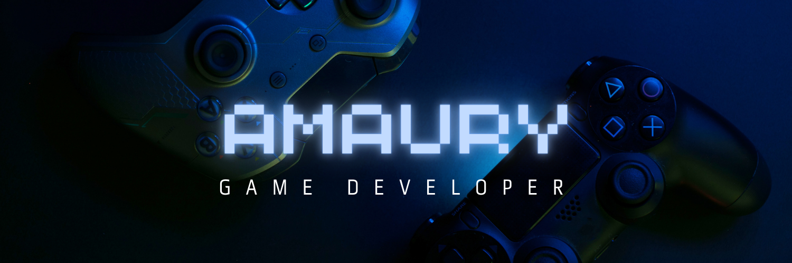

# Hola 👋, Soy amaury 🐢

## Acerca de mi
Soy un estudiante de Ingeniería en Software Interactivo y Videojuegos, tengo conocimiento en areas como:
 - 💻Programación
    - C#
    - Java
    - JavaScript
 - 🎮Diseño de juegos
    - Diseño de niveles
    - Mecanicas
    - Planeación
 - 🎹Música
    - Composición
    - Interpretación
    - FL studio 
 - 🎞️Edición de video
    - DaVinci Resolve 
    - Magix Video Deluxe
 - 📷Edición de Imagen
    - Photoshop
## Proyectos
 participado en la creación de estos juegos:
 - [DefinetlyNotAVirus](https://github.com/amauryxd/DefinitlyNotAVirus-nadasospechoso-)
 - [ProyectoD](https://github.com/amauryxd/ProyectoD)
 - [PongPong](https://github.com/amauryxd/pongxdxd)
 - [MetroidVania](https://github.com/amauryxd/MetroidvaniaAmaury)

## Contactame
📫 correo: cdmx2472@amerike.edu.mx

&nbsp;

